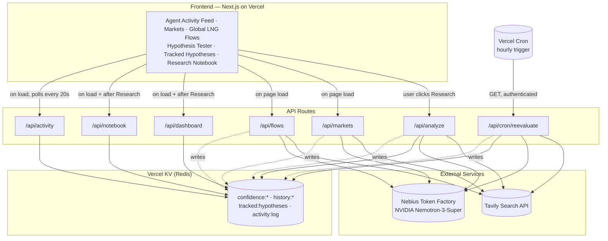

# Solid Natural Gas

**AI-native global gas intelligence.** An agentic LNG market intelligence system, built entirely during the Nebius × NVIDIA Global AI Hackathon Submission Period, that develops, challenges, and continuously updates confidence-scored hypotheses about natural gas pricing using live evidence — and keeps researching autonomously, on its own schedule, whether or not anyone is watching.

🔗 **Live app:** [solidnaturalgas.com](https://www.solidnaturalgas.com)

Built for the Nebius × NVIDIA Global AI Hackathon — **Best Apps and Agents** track.

This entire project — concept, hosting, and every feature described below — was conceived and built from scratch during the Submission Period. There is no pre-existing version.

---

## What it does

Most LLM apps answer a question once and forget it. Solid Natural Gas treats each market hypothesis as a living thing it keeps researching:

- **Test a hypothesis** (e.g. *"European LNG spot prices will strengthen over the next 30 days"*) and get a confidence score (0–100), not just prose — grounded in live web evidence, with every source cited.
- **Confidence persists and evolves.** Each run picks up exactly where the last one left off, whether triggered by a person clicking Research or by the system's own hourly autonomous cycle.
- **A live dashboard of every tracked hypothesis**, each with a confidence-over-time sparkline built from real historical runs.
- **A Research Notebook** — an append-only audit trail of every research cycle: prior confidence, new evidence count, new confidence, and the model's actual reasoning for the change.
- **A live Agent Activity feed** showing the system's autonomous work as it happens: evidence queried, chokepoints checked, hypotheses re-evaluated, confidence scores moved — proof of autonomy, not just a claim of it.
- **A Markets panel** (Henry Hub, TTF, JKM, Brent, WTI) and a **Global LNG Flows panel** (chokepoint status for six major shipping straits/canals, and directional trend for eight major trade corridors) — both derived the same way as the hypothesis engine: live search evidence reasoned over by Nemotron, not a static or paid data feed.

---

## How Nebius and NVIDIA technology power this

This is not decoration — it is the entire product.

### NVIDIA Nemotron, via Nebius Token Factory
Every piece of reasoning in this app — hypothesis evaluation and confidence scoring, Markets price extraction, LNG chokepoint/corridor classification — is done by an **NVIDIA Nemotron-3-Super** model, called through **Nebius Token Factory's** OpenAI-compatible `/chat/completions` endpoint. No hardcoded logic decides any score or status; the model does, constrained by system prompts that require it to cite specific evidence and never invent facts not present in what it was given.

### Tavily
Every Nemotron call above is grounded in live web evidence fetched via the **Tavily Search API**. Sources are surfaced directly in the UI (with links) so a claim can always be traced back to where it came from.

### Vercel KV + Vercel Cron — the autonomous loop
Confidence scores, full historical runs, and the activity log are persisted in **Vercel KV** (Redis). A **Vercel Cron job** calls the re-evaluation endpoint every hour, independently re-running the Tavily → Nemotron pipeline for every tracked hypothesis — no human interaction required. This is what makes the system agentic rather than a chatbot: it keeps researching and updating its own conclusions on a schedule, and the Activity feed lets you watch it do so.

---

## Architecture



**The loop, in words:** a person (or the hourly cron) triggers research on a hypothesis → the route calls Tavily for live evidence → passes that evidence to Nemotron with the hypothesis's last known confidence as context → Nemotron reasons over it and returns an updated confidence + explanation → the new state and a history entry are written to KV → the frontend surfaces all of this live, across the Activity feed, the Tracked Hypotheses dashboard, and the Research Notebook.

---

## API routes

| Route | Method | What it does |
|---|---|---|
| `/api/analyze` | POST | Evaluates a hypothesis against live Tavily evidence via Nemotron; returns confidence, reasoning, and sources; persists to KV |
| `/api/markets` | GET | Extracts 5 benchmark prices (Henry Hub, TTF, JKM, Brent, WTI) from live search evidence via Nemotron; cached 6h |
| `/api/flows` | GET | Classifies status for 6 LNG shipping chokepoints and trend for 8 trade corridors from live evidence via Nemotron; cached 6h |
| `/api/dashboard` | GET | Returns every tracked hypothesis with its current confidence and history, for the sparkline dashboard |
| `/api/notebook` | GET | Merges and sorts the last 20 research entries across all tracked hypotheses into an audit-trail feed |
| `/api/activity` | GET | Returns the last 40 autonomous-activity log entries for the live feed |
| `/api/cron/reevaluate` | GET | Triggered hourly by Vercel Cron; re-runs the full research pipeline for every tracked hypothesis independently of any user |

---

## Tech stack

- **Frontend:** Next.js (App Router), React, deployed on Vercel
- **Reasoning:** NVIDIA Nemotron-3-Super via Nebius Token Factory
- **Live evidence:** Tavily Search API
- **Persistence:** Vercel KV (Redis-compatible)
- **Autonomy:** Vercel Cron (hourly)

## Local setup

```bash
npm install
```

Create a `.env.local` with:

```
NEBIUS_API_KEY=
NEBIUS_BASE_URL=https://api.tokenfactory.nebius.com/v1
NEBIUS_MODEL=nvidia/nemotron-3-super-120b-a12b
TAVILY_API_KEY=
KV_REST_API_URL=
KV_REST_API_TOKEN=
CRON_SECRET=
```

```bash
npm run dev
```

## License

MIT — see [LICENSE](./LICENSE).
